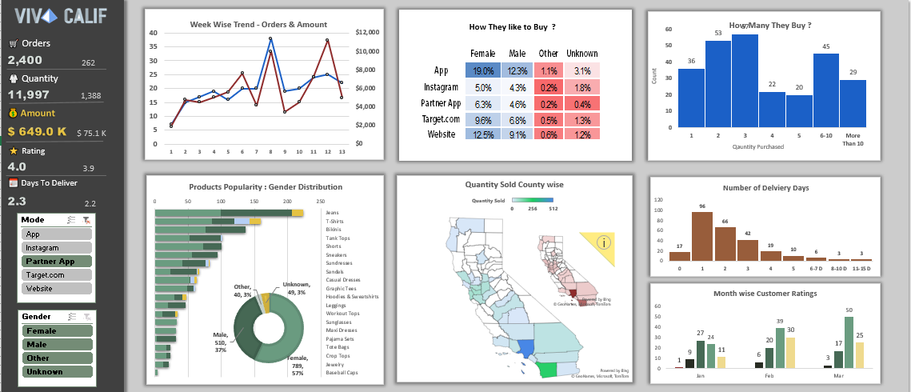

# VivaCalif-Ecommerce-dashboard-analysis
Exploratory data analysis and business insights from E commerce store  sales data using Excel dashboards and pivots.

## Project Overview
This project analyzes Viva Calif E-commerce Store sales data to understand customer behavior, product performance, and operational efficiency using Excel dashboards.

## Business Questions Answered
1. How did sales and orders trend over the last 13 weeks?
2. How do customers prefer to purchase (mode & gender)?
3. How many quantities do customers typically buy?
4. Which products are most popular?
5. How does customer behavior differ by gender?
6. Where do our customers live?
7. How long do we take to ship orders and how does it impact satisfaction?

## Tools Used
- Microsoft Excel (Pivot Tables, Charts, Slicers)

## Key Outcomes
- Identified core products driving revenue
- Highlighted bulk purchase patterns
- Uncovered delivery bottlenecks in high-demand regions
- Provided actionable business recommendations

## Files
- `dashboard/` → Excel dashboard and visuals
- `analysis/` → Question-wise analysis
- `report/` → Final business recommendations

## Dashboard Preview

