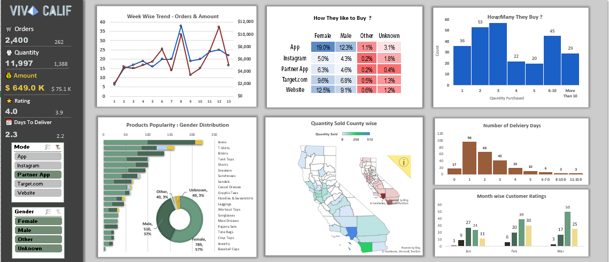

# Viva Calif-Ecommerce-dashboard-analysis
Exploratory data analysis and business insights from E commerce store  sales data using Excel dashboards and pivots.

## Project Overview
This project analyzes Viva Calif E-commerce Store sales data to understand customer behavior, product performance, and operational efficiency using Excel dashboards.

## 🔗 Project Assets

- 📂 **Data Dictionary**: [View Data Definitions](data/data_dictionary.md)
- 📊 **Dashboard**: [View Excel Dashboard](dashboard/Viva_Calif_Dashboard_img.png)
- 🧠 **Analysis Steps**: [View Analysis Process](analysis/analysis_steps.md)
 

## Business Questions Answered
1. How did sales and orders trend over the last 13 weeks?
2. How do customers prefer to purchase (mode & gender)?
3. How many quantities do customers typically buy?
4. Which products are most popular?
5. How does customer behavior differ by gender?
6. Where do our customers live?
7. How long do we take to ship orders and how does it impact satisfaction?

## Tools Used
- Microsoft Excel (Pivot Tables, Charts, Slicers)

## Key Outcomes
- Identified core products driving revenue
- Highlighted bulk purchase patterns
- Uncovered delivery bottlenecks in high-demand regions
- Provided actionable business recommendations

## 📈 Business Impact

- Identified **core revenue-driving products** (T-shirts, Jeans, Sneakers) to prioritize inventory and promotions.
- Found strong **bulk-buying behavior**, bundle buy offers to increase order value.
- Highlighted **high-performing regions** to focus marketing and operational efforts.
- Detected **delivery delays in a few high-demand zones**, enabling targeted logistics improvements.
- Confirmed overall **high customer satisfaction**, supporting safe business expansion.

## Files
- `dashboard/` → Excel dashboard and visuals
- `analysis/` → Question-wise analysis
- `report/` → Final business recommendations
  

## 📄 Project Report

A detailed business analysis report covering insights, recommendations, and limitations:

👉 [View Full Business Report](report/Final_Business_Report.md)

## Dashboard Preview

## Data Source & Acknowledgement

- The dataset and dashboard inspiration were sourced from a publicly available YouTube tutorial.
- All business questions, analysis, insights, and recommendations were independently developed as part of this project.

**Credit:** YouTube channel – Chandoo

